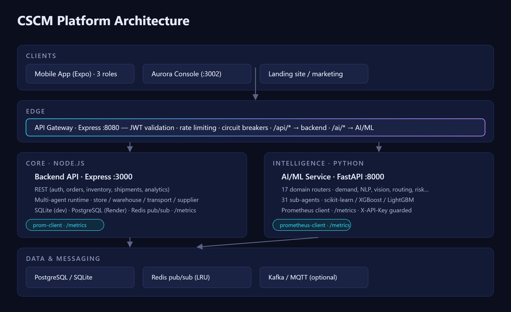
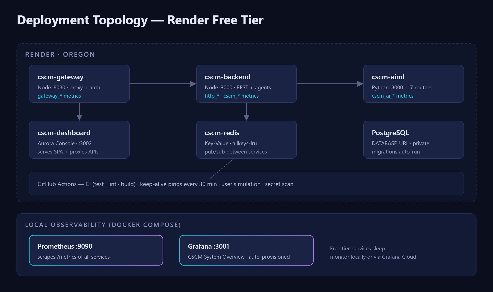
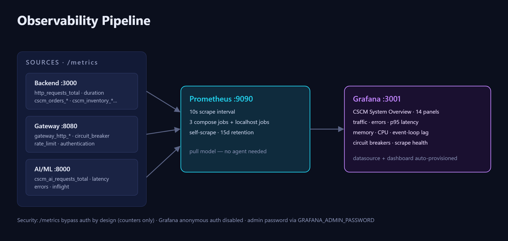

<div align="center">


**A multi-tier supply chain intelligence platform**
Node.js backend · Python AI/ML (31 sub-agents) · API gateway · Aurora operations console · React Native mobile app

    

</div>

---

## What is CSCM?

CSCM models a full supply chain as a **mesh of cooperating agents** — shopkeepers, transporters, wholesalers, warehouses and planners — coordinated through a REST core and a Python AI/ML service covering 17 intelligence domains (demand forecasting, NLP, computer vision, routing, supplier risk, digital twins, explainability…). Operations are driven day-to-day from the **Aurora Console** (web ops dashboard) and a 3-role mobile app, with end-to-end observability via Prometheus + Grafana.

## Architecture



## Deployment (Render free tier)



## Observability



## Services

| Service | Stack | Port | Entry point |
|---|---|---|---|
| **Backend API** | Express.js, SQLite/PostgreSQL, Redis pub/sub | 3000 | `backend/src/api/server.js` |
| **API Gateway** | Express.js, JWT, circuit breakers, rate limiting | 8080 | `backend/src/gateway/gateway.js` |
| **AI/ML Service** | FastAPI, 17 routers, scikit-learn / XGBoost / LightGBM | 8000 | `ai-ml/api/main.py` |
| **Aurora Console** | React 18 + Vite, command palette (Ctrl+K), live WebSocket status | 3002 | `dev-dashboard/server.cjs` |
| **Mobile App** | React Native / Expo SDK 54, 3 role portals + mesh console | — | `App/` |
| **Prometheus** | Metrics scraping (10s) | 9090 | `docker compose up -d prometheus` |
| **Grafana** | Auto-provisioned dashboards | 3001 | `docker compose up -d grafana` |

## Quick Start

### One-command dev environment

```bash
# Windows
./scripts/setup-dev.ps1 && ./scripts/start-dev.ps1

# Linux / macOS
./scripts/setup-dev.sh && ./scripts/start-dev.sh
```

### Manual setup

```bash
# Backend + gateway
cd backend && npm install
npm start                        # API on :3000
GATEWAY_PORT=8080 node src/gateway/gateway.js   # gateway on :8080

# AI/ML
cd ai-ml && pip install -r requirements.txt
uvicorn api.main:app --port 8000

# Ops console
cd dev-dashboard && npm install && npm run build
npm start                        # console on :3002

# Mobile
cd App && npm install && npx expo start
```

### Observability stack (Docker)

```bash
docker compose up -d prometheus grafana
# Grafana  http://localhost:3001  (dashboard auto-provisioned)
# Prometheus http://localhost:9090
```

Full deployment runbook (env vars, secret pairing, verification, rollback): **[DEPLOYMENT.md](DEPLOYMENT.md)**

## Project Structure

```
cscm/
├── App/              # React Native mobile app (Expo SDK 54)
│   └── users/        # Role portals: shopkeeper / transporter / wholesaler / mesh
├── backend/          # Express API (:3000) + gateway (:8080)
│   └── src/          # Routes, 31 sub-agents, middleware, storage, analytics
├── ai-ml/            # FastAPI service (:8000)
│   ├── api/          # 17 domain routers + middleware
│   └── legacy_models/ # Model implementations (demand, NLP, CV, …)
├── dev-dashboard/    # Aurora Console (React + Vite + Node proxy server)
├── grafana/          # Provisioned dashboards + datasource
├── prometheus/       # Scrape configuration
├── config/           # Logstash pipeline config
├── docs/             # Architecture docs, OpenAPI spec, diagram assets
├── scripts/          # Dev setup, deployment helpers, diagram renderer
└── website/          # Landing/marketing site
```

## Metrics & Dashboards

Each service exposes Prometheus-format `/metrics`:

| Source | Metrics |
|---|---|
| Backend | `http_requests_total`, `http_request_duration_seconds_*`, `cscm_users_*`, `cscm_orders_*`, `cscm_inventory_*`, `cscm_shipments_*`, `errors_total` |
| Gateway | `gateway_http_requests_total`, `gateway_circuit_breaker_state`, `gateway_rate_limit_hits_total`, `gateway_authentication_*` |
| AI/ML | `cscm_ai_requests_total`, `cscm_ai_request_duration_seconds_*`, `cscm_ai_errors_total`, `cscm_ai_inflight_requests` |

The provisioned Grafana dashboard (**CSCM System Overview**) ships with traffic, error-rate, p95 latency, resource and circuit-breaker panels. See **[docs/OBSERVABILITY.md](docs/OBSERVABILITY.md)**.

## Testing & CI

```bash
cd backend && npm test             # 775 unit tests
cd backend && npm run test:integration   # JS↔Python contract suite
cd ai-ml && pytest
cd dev-dashboard && npm run build  # console build check
```

CI (GitHub Actions): backend lint + test matrix (Node 18/20), AI/ML pytest, dashboard build, integration contract tests, and a scheduled secret scan.

## Environment Variables

Copy each `.env.example` to `.env` and fill in values — never commit real secrets:

- [`backend/.env.example`](backend/.env.example) — DB, Redis, JWT, AI/ML URL+key
- [`dev-dashboard/.env.example`](dev-dashboard/.env.example) — service URLs, dashboard login, shared secrets

> **Key pairing rule:** `JWT_SECRET` (backend) = gateway's `JWT_SECRET` = dashboard's `BACKEND_JWT_SECRET`, and `AI_ML_API_KEY` must match across backend, gateway, dashboard and ai-ml. Full matrix in [DEPLOYMENT.md](DEPLOYMENT.md).

## Contributing

Contributions welcome — see [CONTRIBUTING.md](CONTRIBUTING.md) for the workflow and code standards. For security issues, please follow the disclosure process in [SECURITY.md](SECURITY.md) rather than opening a public issue.

## License

[MIT](LICENSE)
